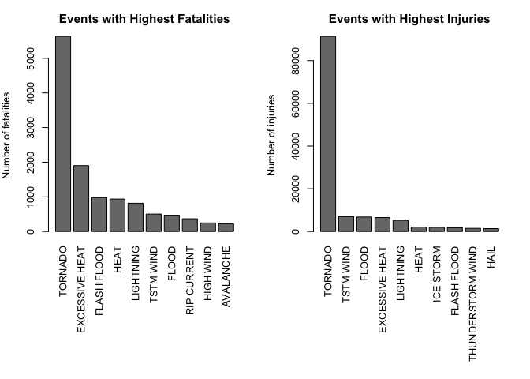
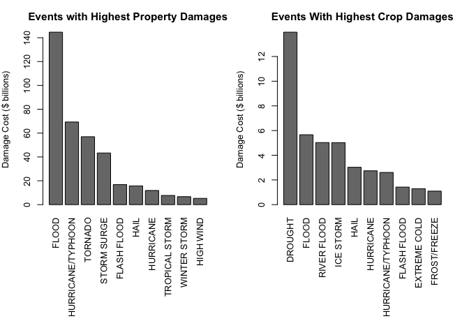

# Synopsis

Severe weather events such as storms can cause both public health and economic problems for communities and municipalities. Many severe events can result in fatalities, injuries, and property damage, and preventing such outcomes to the extent possible is a key concern. This project involves exploring the U.S. National Oceanic and Atmospheric Administration’s (NOAA) storm database. This database tracks characteristics of major storms and weather events in the United States, including when and where they occur, as well as estimates of any fatalities, injuries, and property damage. In this report, the top ten events that caused the most population damage and economic damage are calculated and plotted.  

# Analysis

## Data

The data for this assignment come in the form of a comma-separated-value file compressed via the bzip2 algorithm to reduce its size. You can download the file from the course web site. It can also be found at [noaa website](https://www.ncdc.noaa.gov/stormevents/ftp.jsp).

There is also some documentation of the database available. Here you will find how some of the variables are constructed/defined.

- [National Weather Service Storm Data Documentation](https://d396qusza40orc.cloudfront.net/repdata%2Fpeer2_doc%2Fpd01016005curr.pdf)

- [National Climatic Data Center Storm Events FAQ](https://d396qusza40orc.cloudfront.net/repdata%2Fpeer2_doc%2FNCDC%20Storm%20Events-FAQ%20Page.pdf)

### Assignment

The basic goal of this assignment is to explore the NOAA Storm Database and answer two basic questions:

- Across the United States, which types of events (as indicated in the 𝙴𝚅𝚃𝚈𝙿𝙴 variable) are most harmful with respect to population health?
- Across the United States, which types of events have the greatest economic consequences?

### Process

The data is downloaded from coursera website and then unziped, imported and processed with the following codes.


```r
data_raw <- repdata.data.StormData <- read.csv("~/Documents/Coursera-Data-Science-data/repdata-data-StormData.csv")
```

### Extracting the Required Data


```r
selected <- c("EVTYPE", "FATALITIES", "INJURIES", "PROPDMG", "PROPDMGEXP", "CROPDMG", "CROPDMGEXP")
data <- data_raw[selected]
```

### Calculating Property Damage

The property damage value was calculated by multiplying the property damage and property exponent value. The intepration of the characters of the variable "PROPEXP" is based on [this article](https://rstudio-pubs-static.s3.amazonaws.com/58957_37b6723ee52b455990e149edde45e5b6.html). The character of "+", "-" and "?" are converted to 0.


```r
data$PROPEXP[data$PROPDMGEXP == "K"] <- 1000
data$PROPEXP[data$PROPDMGEXP == "M"] <- 1e+06
data$PROPEXP[data$PROPDMGEXP == ""] <- 1
data$PROPEXP[data$PROPDMGEXP == "B"] <- 1e+09
data$PROPEXP[data$PROPDMGEXP == "m"] <- 1e+06
data$PROPEXP[data$PROPDMGEXP == "0"] <- 1
data$PROPEXP[data$PROPDMGEXP == "5"] <- 1e+05
data$PROPEXP[data$PROPDMGEXP == "6"] <- 1e+06
data$PROPEXP[data$PROPDMGEXP == "4"] <- 10000
data$PROPEXP[data$PROPDMGEXP == "2"] <- 100
data$PROPEXP[data$PROPDMGEXP == "3"] <- 1000
data$PROPEXP[data$PROPDMGEXP == "h"] <- 100
data$PROPEXP[data$PROPDMGEXP == "7"] <- 1e+07
data$PROPEXP[data$PROPDMGEXP == "H"] <- 100
data$PROPEXP[data$PROPDMGEXP == "1"] <- 10
data$PROPEXP[data$PROPDMGEXP == "8"] <- 1e+08
data$PROPEXP[data$PROPDMGEXP == "+"] <- 0
data$PROPEXP[data$PROPDMGEXP == "-"] <- 0
data$PROPEXP[data$PROPDMGEXP == "?"] <- 0
data$PROPDMGVAL <- data$PROPDMG * data$PROPEXP
```
### Calculating Crop Damage


```r
data$CROPEXP[data$CROPDMGEXP == "M"] <- 1e+06
data$CROPEXP[data$CROPDMGEXP == "K"] <- 1000
data$CROPEXP[data$CROPDMGEXP == "m"] <- 1e+06
data$CROPEXP[data$CROPDMGEXP == "B"] <- 1e+09
data$CROPEXP[data$CROPDMGEXP == "0"] <- 1
data$CROPEXP[data$CROPDMGEXP == "k"] <- 1000
data$CROPEXP[data$CROPDMGEXP == "2"] <- 100
data$CROPEXP[data$CROPDMGEXP == ""] <- 1
data$CROPEXP[data$CROPDMGEXP == "?"] <- 0
data$CROPDMGVAL <- data$CROPDMG * data$CROPEXP
```

### Summarizing

Fatalities and injuries are selected as the main factors that reflecting the degree of harm with respect to population. Property and crop damages are selected as the main factors that reflecting the degree of harm with respect to economic.


```r
fatal <- aggregate(FATALITIES ~ EVTYPE, data, FUN = sum)
injury <- aggregate(INJURIES ~ EVTYPE, data, FUN = sum)
prop_dmg <- aggregate(PROPDMGVAL ~ EVTYPE, data, FUN = sum)
crop_dmg <- aggregate(CROPDMGVAL ~ EVTYPE, data, FUN = sum)
```

### Plotting

Highest fatalities and highest injuries for Top 10 events were plotted as below.


```r
fatal10 <- fatal[order(-fatal$FATALITIES), ][1:10, ]
injury10 <- injury[order(-injury$INJURIES), ][1:10, ]
par(mfrow = c(1, 2), mar = c(12, 4, 3, 2), mgp = c(3, 1, 0), cex = 0.8)
barplot(fatal10$FATALITIES, las = 3, names.arg = fatal10$EVTYPE, main = "Events with Highest Fatalities", 
        ylab = "Number of fatalities", col = "gray47")
barplot(injury10$INJURIES, las = 3, names.arg = injury10$EVTYPE, main = "Events with Highest Injuries", 
        ylab = "Number of injuries", col = "gray47")
```

<!-- -->

Highest Property damage and highest crop damage for Top 10 events were plotted as below.


```r
prop_dmg10 <- prop_dmg[order(-prop_dmg$PROPDMGVAL), ][1:10, ]
crop_dmg10 <- crop_dmg[order(-crop_dmg$CROPDMGVAL), ][1:10, ]
par(mfrow = c(1, 2), mar = c(12, 4, 3, 2), mgp = c(3, 1, 0), cex = 0.8)
barplot(prop_dmg10$PROPDMGVAL/(10^9), las = 3, names.arg = prop_dmg10$EVTYPE, 
        main = "Events with Highest Property Damages", ylab = "Damage Cost ($ billions)", 
        col = "gray47")
barplot(crop_dmg10$CROPDMGVAL/(10^9), las = 3, names.arg = crop_dmg10$EVTYPE, 
        main = "Events With Highest Crop Damages", ylab = "Damage Cost ($ billions)", 
        col = "gray47")
```

<!-- -->

# Conclusion

In a nutshell, Tornado is absolutely the most powerful event that could cause the most serious damage to population health. Excessive Heat and Thunderstorm Wind are two other top events.

Flood caused the maximum property damage and also ranked second in the crop damage, where Drought caused the maximum crop damage but not much property damage. I would like to say that Flood is the most powerful event that cause the most serious damage to economy.
