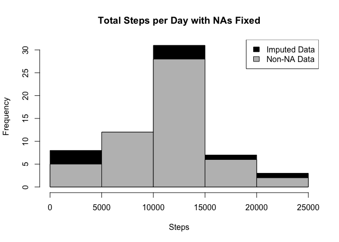
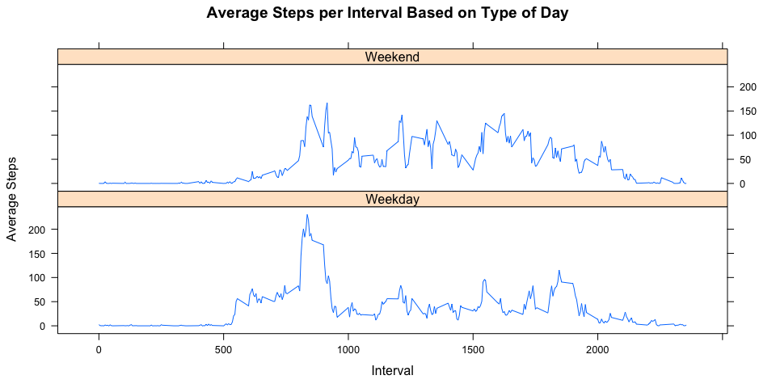

# Reproducible Research: Peer Assessment 1


## Loading and preprocessing the data

The data is stored in the variable "data", with date information transformed into "Date" datatype. 


```r
data <- read.csv("activity.csv")
data$date <- as.Date(data$date, format = "%Y-%m-%d")
```

```
## Warning in strptime(x, format, tz = "GMT"): unknown timezone 'zone/tz/
## 2018c.1.0/zoneinfo/America/New_York'
```

```r
data <- data[!is.na(data$steps),]
```

## What is mean total number of steps taken per day?


```r
total_steps_daily <- aggregate(as.numeric(data$steps), by=list(data$date), FUN=sum, na.rm=TRUE)
names(total_steps_daily) <- c("date","steps")
hist(total_steps_daily$steps, xlab = "Steps", main = "Total Daily Steps Distribution")
```

<!-- -->

```r
total_steps_mean <- mean(total_steps_daily$steps)
total_steps_median <- median(total_steps_daily$steps)
```

The mean and median of the total number of steps taken per day are 1.0766189\times 10^{4} and 1.0765\times 10^{4}, respectively.

## What is the average daily activity pattern?


```r
library(plyr)
average_steps_interval <- ddply(data, .(interval), summarize, Avg = mean(steps))
names(average_steps_interval) <- c("Interval","Average steps")

plot(average_steps_interval,type = "l", main = "Average Number of Steps per 5-minute Interval")
```

<!-- -->

```r
interval_max_steps <- max(average_steps_interval$`Average steps`)
interval_max_steps_columnindex <-which.max(average_steps_interval$`Average steps`)
interval_max_steps_Time <- average_steps_interval[interval_max_steps_columnindex,1]
```

The 5-minute interval, on average across all the days in the dataset, that contains the maximum number of steps is the 835 interval.

## Imputing missing values


```r
data2 <- read.csv("activity.csv")
data2$date <- as.Date(data2$date, format = "%Y-%m-%d")
count_na_val <- sum(is.na(data2$steps))

clean <- data2[!is.na(data2$steps),]
nadata <- data2[is.na(data2$steps),]

replace_data <- ddply(clean, .(interval), summarize, mean(steps))
names(replace_data)[2] <- "steps"
newdata<-merge(nadata, replace_data, by=c("interval"))
newdata <- newdata[-2]
names(newdata)[3] <- "steps"

newdata2<- newdata[,c(3,2,1)]
mergeData <- rbind(clean, newdata2)
```

The total number of missing values in the dataset are 2304 rows. The strategy of replacing NAs is using the mean value for the corresponding 5-minute interval in this study. The modified data is stored in the new dataframe named "data2".


```r
total_steps_daily_2 <- aggregate(as.numeric(mergeData$steps), by=list(data2$date), FUN=sum, na.rm=TRUE)
names(total_steps_daily_2) <- c("date","steps")
total_steps_mean_2 <- mean(total_steps_daily_2$steps)
total_steps_median_2 <- median(total_steps_daily_2$steps)

hist(total_steps_daily_2$steps, breaks=5, xlab="Steps", main = "Total Steps per Day with NAs Fixed", col="Black")
hist(total_steps_daily$steps, breaks=5, xlab="Steps", main = "Total Steps per Day with NAs Fixed", col="Grey", add=T)
legend("topright", c("Imputed Data", "Non-NA Data"), fill=c("black", "grey") )
```

<!-- -->

The mean and median of the total number of steps taken per day with NA replacement are 1.0766189\times 10^{4} and 1.1015\times 10^{4}, respectively. The comparison between with NA replacement and without NA replacement is shown below. The overall shape of the distribution has not changed.

Value Type  |    w/o NA Replacement      | w/ NA Replacement
----------- | ---------------------------| -------------
mean        | 1.0766189\times 10^{4}       |  1.0766189\times 10^{4}
madian      | 1.0765\times 10^{4}     |  1.1015\times 10^{4}

## Are there differences in activity patterns between weekdays and weekends?


```r
mergeData$day <- weekdays(as.Date(mergeData$date))
mergeData$DateTime<- as.POSIXct(mergeData$date, format="%Y-%m-%d")
mergeData$DayCategory <- ifelse(mergeData$day %in% c("Saturday", "Sunday"), "Weekend", "Weekday")
library(lattice)
steps_daytype <- ddply(mergeData, .(interval, DayCategory), summarize, Avg = mean(steps))

xyplot(Avg~interval|DayCategory, data=steps_daytype, type="l",  layout = c(1,2),
       main="Average Steps per Interval Based on Type of Day", 
       ylab="Average Steps", xlab="Interval")
```

<!-- -->
       
According to the plot above, people tend to walk more steps at weekend. It is probably because people have more free time at the weekend for outdoor activities.
