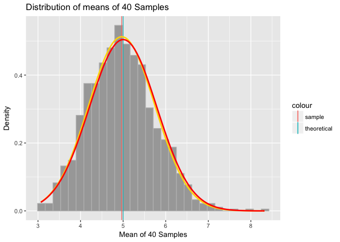

# Overview

This is the first part of the Statistical Inference Course Project from Coursera. It is demonstrated that the distribution proves the Central Limit Theorem. This assignment will make calculation and plots and compare confidence intervals, and eventually proves that the distribution is approximately normal.

# Tasks

In this project you will investigate the exponential distribution in R and compare it with the Central Limit Theorem. The exponential distribution can be simulated in R with rexp(n, lambda) where lambda is the rate parameter. The mean of exponential distribution is 1/lambda and the standard deviation is also 1/lambda. Set lambda = 0.2 for all of the simulations. You will investigate the distribution of averages of 40 exponentials. Note that you will need to do a thousand simulations.

Illustrate via simulation and associated explanatory text the properties of the distribution of the mean of 40 exponentials. You should
- Show the sample mean and compare it to the theoretical mean of the distribution.
- Show how variable the sample is (via variance) and compare it to the theoretical variance of the distribution.
- Show that the distribution is approximately normal.

In point 3, focus on the difference between the distribution of a large collection of random exponentials and the distribution of a large collection of averages of 40 exponentials.


# Analysis

## Setting

The exponential distribution can be simulated in R with rexp(n, lambda) where lambda is the rate parameter. The mean of exponential distribution is 1/lambda and the standard deviation is also also 1/lambda. Set lambda = 0.2 for all of the simulations. In this simulation, you will investigate the distribution of averages of 40 exponential(0.2)s. Note that you will need to do a thousand or so simulated averages of 40 exponentials.


```r
set.seed(127)
lambda <- 0.2
n <- 40
sample_size <- 1000
simulated_sample <- replicate(sample_size, rexp(n, lambda))
means_exponentials <- apply(simulated_sample, 2, mean)
```
## Meam Comparison


```r
sample_mean <- mean(means_exponentials)
theo_mean <- 1 / lambda
```

The mean of the sample means is 4.9668844 and the theoritical mean is 5. The sample mean and the theoretical mean (expected mean) are very close.

## Variance Comparison

```r
sample_var <- var(means_exponentials)
theo_var  <- (1 / lambda)^2 / (n) 
sample_sd <- sd(means_exponentials)
theo_sd  <- 1/(lambda * sqrt(n))
```

The variance of the sample means is 0.6048268 and the thoeretical variance of the distribution is 0.625. Both variance values are very close to each other. Meanwhile, the standard deviation of the sample means is 0.7777061 and the thoeretical standard deviation of the distribution is 0.7905694. Both standard deviation values are very close to each other.

## Distribution


```r
plotdata <- data.frame(means_exponentials)
m <- ggplot(plotdata, aes(x =means_exponentials))
m <- m + geom_histogram(aes(y=..density..), colour="grey",
                        fill = "grey66")
m <- m + labs(title = "Distribution of means of 40 Samples", x = "Mean of 40 Samples", y = "Density")
m <- m + geom_vline(aes(xintercept = sample_mean, colour = "sample"))
m <- m + geom_vline(aes(xintercept = theo_mean, colour = "theoretical"))
m <- m + stat_function(fun = dnorm, args = list(mean = sample_mean, sd = sample_sd), color = "gold1", size = 1.0)
m <- m + stat_function(fun = dnorm, args = list(mean = theo_mean, sd = theo_sd), colour = "red", size = 1.0)
m
```

```
## `stat_bin()` using `bins = 30`. Pick better value with `binwidth`.
```

<!-- -->

The density of the actual data is shown by the light blue bars. The theoretical mean and the sample mean are so close that they nearly overlap. The “red” line shows the normal curve formed by the the theoretical mean and standard deviation. The “gold” line shows the curve formed by the sample mean and standard deviation. As you can see from the graph, the distribution of means of 40 exponential distributions is close to the normal distribution with the expected theoretical values based on the given lambda.

## Confidence Interval


```r
sample_confinterval <- round (mean(means_exponentials) + c(-1,1)*1.96*sd(means_exponentials)/sqrt(n),3)
theo_confinterval <- theo_mean + c(-1,1) * 1.96 * sqrt(theo_var)/sqrt(n)
```
The sample confidence interval is (4.726, 5.208) and the theoretical confidence level is (4.755, 5.245) . The confidence levels also match closely. Again, proving the distribution is approximately normal.
