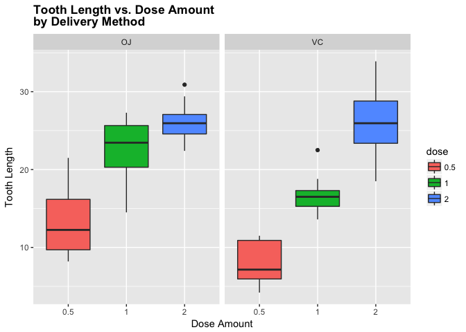
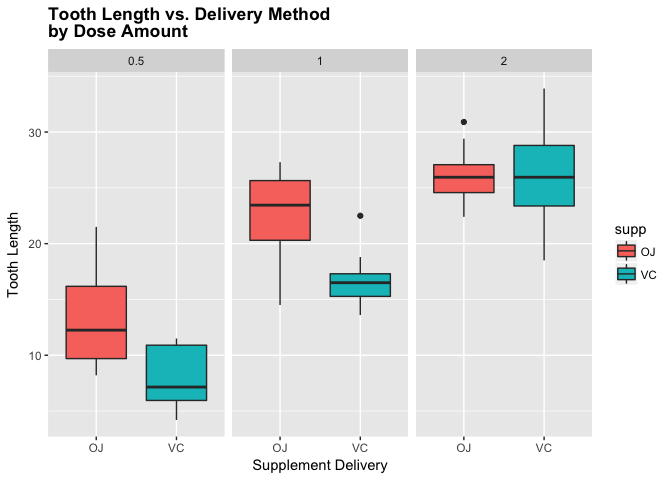

# Overview

This is the second part of the Statistical Inference Course Project from Coursera. A few EDA methods will be carried out as well as applying two-sample t-test to analyze the relationships between factors.

# Tasks

- Load the ToothGrowth data and perform some basic exploratory data analyses
- Provide a basic summary of the data.
- Use confidence intervals and/or hypothesis tests to compare tooth growth by supp and dose. (Only use the techniques from class, even if there's other approaches worth considering)
- State your conclusions and the assumptions needed for your conclusions.

# Analysis

## EDA 


```r
data("ToothGrowth")
```


```r
head(ToothGrowth)
```

```
##    len supp dose
## 1  4.2   VC  0.5
## 2 11.5   VC  0.5
## 3  7.3   VC  0.5
## 4  5.8   VC  0.5
## 5  6.4   VC  0.5
## 6 10.0   VC  0.5
```

```r
summary(ToothGrowth$len)
```

```
##    Min. 1st Qu.  Median    Mean 3rd Qu.    Max. 
##    4.20   13.07   19.25   18.81   25.27   33.90
```

```r
unique(ToothGrowth$supp)
```

```
## [1] VC OJ
## Levels: OJ VC
```

```r
table(ToothGrowth$supp)
```

```
## 
## OJ VC 
## 30 30
```

```r
summary(ToothGrowth$dose)
```

```
##    Min. 1st Qu.  Median    Mean 3rd Qu.    Max. 
##   0.500   0.500   1.000   1.167   2.000   2.000
```

```r
unique(ToothGrowth$dose)
```

```
## [1] 0.5 1.0 2.0
```

```r
summary(ToothGrowth$dose)
```

```
##    Min. 1st Qu.  Median    Mean 3rd Qu.    Max. 
##   0.500   0.500   1.000   1.167   2.000   2.000
```

```r
nrow(ToothGrowth)
```

```
## [1] 60
```

There are three variables named len, supp, dose with 60 obersvations in the dataset. The summary function provides the overall distribution of the "len" variables. The "supp" variable has two categrories: VC, OJ, each belongs to 30 obersvations. The "dose" variable has three categrories: 0.5, 1, 2, each belongs to 20 obersvations.


```r
sapply(ToothGrowth, class)
```

```
##       len      supp      dose 
## "numeric"  "factor" "numeric"
```

```r
ToothGrowth$dose <- as.factor(ToothGrowth$dose)

ggplot(aes(x=dose, y=len), data=ToothGrowth) + geom_boxplot(aes(fill=dose)) + xlab("Dose Amount") + ylab("Tooth Length") + facet_grid(~ supp) + ggtitle("Tooth Length vs. Dose Amount \nby Delivery Method") + 
     theme(plot.title = element_text(lineheight=.8, face="bold"))
```

<!-- -->

This graph shows the relationship between tooth length and dose amount. It demonstrates a positive relationship between dose amount and tooth length, indicating that increasing dose amount within particular level can benefit tooth growth. Meanwhile, this effect differs from two types of supplement delivery, which worths further investigation.


```r
ggplot(aes(x=supp, y=len), data=ToothGrowth) + geom_boxplot(aes(fill=supp)) + xlab("Supplement Delivery") + ylab("Tooth Length") + facet_grid(~ dose) + ggtitle("Tooth Length vs. Delivery Method \nby Dose Amount") + 
     theme(plot.title = element_text(lineheight=.8, face="bold"))
```

<!-- -->

This graph shows the relationship between tooth length and supplement delivery method. When the dose amount is at 0.5 and 1.0, supplement delivery of "OJ" has a stronger positive effect of tooth length. However, this effect is minor when the dose amount is at 2.0.


```r
t.test(len~supp,data=ToothGrowth)
```

```
## 
## 	Welch Two Sample t-test
## 
## data:  len by supp
## t = 1.9153, df = 55.309, p-value = 0.06063
## alternative hypothesis: true difference in means is not equal to 0
## 95 percent confidence interval:
##  -0.1710156  7.5710156
## sample estimates:
## mean in group OJ mean in group VC 
##         20.66333         16.96333
```

Since p value is greater than 0.05, it can be concluded that supplement delivery methods have no impact on Tooth growth.


```r
ToothGrowth_sub1 <- subset(ToothGrowth, ToothGrowth$dose %in% c(1.0,0.5))
t.test(len~dose,data=ToothGrowth_sub1)
```

```
## 
## 	Welch Two Sample t-test
## 
## data:  len by dose
## t = -6.4766, df = 37.986, p-value = 1.268e-07
## alternative hypothesis: true difference in means is not equal to 0
## 95 percent confidence interval:
##  -11.983781  -6.276219
## sample estimates:
## mean in group 0.5   mean in group 1 
##            10.605            19.735
```


```r
ToothGrowth_sub2 <- subset(ToothGrowth, ToothGrowth$dose %in% c(0.5,2.0))
t.test(len~dose,data=ToothGrowth_sub2)
```

```
## 
## 	Welch Two Sample t-test
## 
## data:  len by dose
## t = -11.799, df = 36.883, p-value = 4.398e-14
## alternative hypothesis: true difference in means is not equal to 0
## 95 percent confidence interval:
##  -18.15617 -12.83383
## sample estimates:
## mean in group 0.5   mean in group 2 
##            10.605            26.100
```


```r
ToothGrowth_sub3 <- subset(ToothGrowth, ToothGrowth$dose %in% c(2.0,1.0))
t.test(len~dose,data=ToothGrowth_sub2)
```

```
## 
## 	Welch Two Sample t-test
## 
## data:  len by dose
## t = -11.799, df = 36.883, p-value = 4.398e-14
## alternative hypothesis: true difference in means is not equal to 0
## 95 percent confidence interval:
##  -18.15617 -12.83383
## sample estimates:
## mean in group 0.5   mean in group 2 
##            10.605            26.100
```

As can be seen, the p-value of each test was far below 0.05. We can assume that the average tooth length increases with an inceasing dose, and therefore the null hypothesis can be rejected.

# Conclusion

Based the following assumptions:

- The samples are independent and representative of the population
- The distribution of the sample means follows the Central Limit Theorem
- The 95% confidence interval is adapted as the standard.

In reviewing our t-test analysis from above, we can conclude that supplement delivery method has no effect on tooth growth at 95% confidence interval. While increased doses benefits tooth growth.
